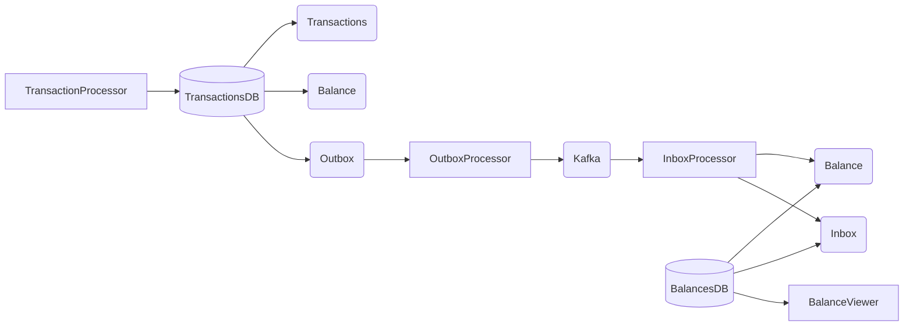

# Transactions System

Распределенная микросервисная система для обработки платежей и просмотра баланса аккаунта. Проект написан на Go и построен на основе архитектурного паттерна **CQRS** (Command Query Responsibility Segregation).

## Идея

Система разделяет логику проведения платежей (Command) и логику получения информации о балансе (Query), чтобы каждый узел можно было масштабировать независимо:

- **Обработка транзакций (Command):** Пользователи совершают переводы (списания/пополнения). Сервис транзакций отвечает только за быструю валидацию и сохранение записи о платеже в свою базу данных.
- **Синхронизация данных:** Чтобы обновить баланс пользователя, используется асинхронный обмен сообщениями через **Apache Kafka**. Для надежности и гарантии того, что ни один платеж не потеряется, применяются паттерны **Transactional Outbox** (отправка сообщений) и **Inbox** (защита от дубликатов при получении).
- **Просмотр баланса (Query):** Сервис балансов хранит уже подсчитанные актуальные остатки в своей собственной базе данных. Когда пользователь запрашивает баланс, система мгновенно отдает готовое значение, не тратя время на пересчет всей истории платежей.

## Архитектура системы

Проект состоит из следующих независимых компонентов:

1. **Transaction Processor** — принимает HTTP-запросы на создание транзакций и сохраняет их в `TransactionsDB` (PostgreSQL).
2. **Outbox Processor** — фоновый процесс, который считывает новые транзакции из БД и отправляет их как события в брокер сообщений Kafka.
3. **Inbox Processor** — считывает события о транзакциях из Kafka и обновляет итоговый баланс пользователя в `BalancesDB` (PostgreSQL).
4. **Balance Viewer** — предоставляет быстрый HTTP API для просмотра текущего баланса, обращаясь напрямую к `BalancesDB`.

## Диаграмма



## Стек технологий

- **Язык**: Go (Go Workspaces)
- **Базы данных**: PostgreSQL (две независимые БД)
- **Брокер сообщений**: Apache Kafka + Zookeeper
- **Service Discovery**: HashiCorp Consul
- **Инструменты**: Docker & Docker Compose, golang-migrate, k6 (нагрузочное тестирование), go-chi.

## API Эндпоинты

### Транзакции (`transaction-processor`)
- `POST /api/v1/transactions` — создать новую транзакцию.

### Баланс (`balance-viewer`)
- `GET /api/v1/account/{account_id}/balance` — получить текущий баланс пользователя.

## Быстрый запуск

Для запуска проекта локально требуется [Docker](https://www.docker.com/) и `docker-compose`.

1. Настройте переменные окружения в файле `.env` (при необходимости).
2. Запустите все сервисы и базы данных одной командой:

```bash
docker compose up --build
```

Docker Compose автоматически поднимет базы данных, применит миграции, запустит Kafka, Consul и все Go-микросервисы.

- **Kafka UI** доступен по адресу: http://localhost:8080
- **Consul UI** доступен по адресу: http://localhost:8500

## Нагрузочное тестирование (k6)

В директории `k6/` находятся скрипты для проверки производительности:
```bash
# Тестирование создания транзакций
k6 run k6/transactions/create-transaction.js

# Тестирование просмотра балансов
k6 run k6/balances/get-balance.js
```
